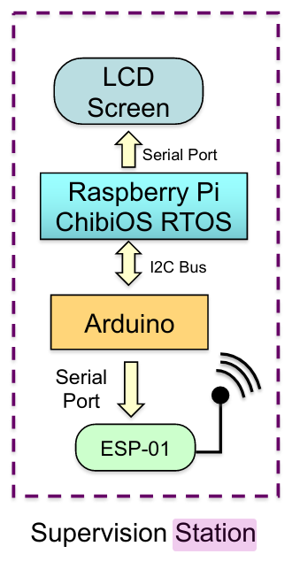

# Supervision
In the image below is shown the prototype proposal of the **Supervision station**.

## Requirements

The Supervision station has these requirements:

- There is just only one Supervision Station for the whole WTGF.
- All sensors are placed far from the Supervision Station.
- Whole WTGF data is transferred to the Supervision Station through a MQTT broker.

## User story 

- Maintenance manager requires graphically representation of the obtained sensor data, within the last 24h, in the Supervision Station.

