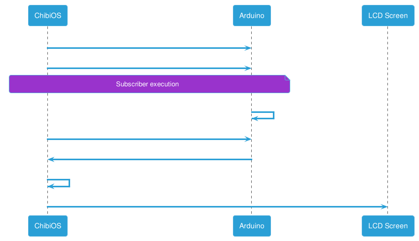

# Supervision
In the image below is shown the prototype proposal of the **Supervision station**.

## Requirements

The Supervision station has these requirements:

- There is just only one Supervision Station for the whole WTGF.
- All sensors are placed far from the Supervision Station.
- Whole WTGF data is transferred to the Supervision Station through a MQTT broker.

## User story 
- Maintenance manager requires graphically representation of the obtained sensor data, within the last 24h, in the Supervision Station.

As the last 24 hours is hard to debug, it is shown instead the last 24 values in the code. To change this, make the delay of requesting the data for an hour or compute the median for it.

## The schema

## Sequence diagram
It shall be described the sequence diagrams used in the supervision station.
### ChibiOS and Arduino communication

### Arduino and ESP01 communication

## ChibiOS
In order to find more information of ChibiOS, go [here](chibios.md).

## ESP-01 Subscriber
In order to find more information of ESP-01 Subscriber, go [here](esp01.md).