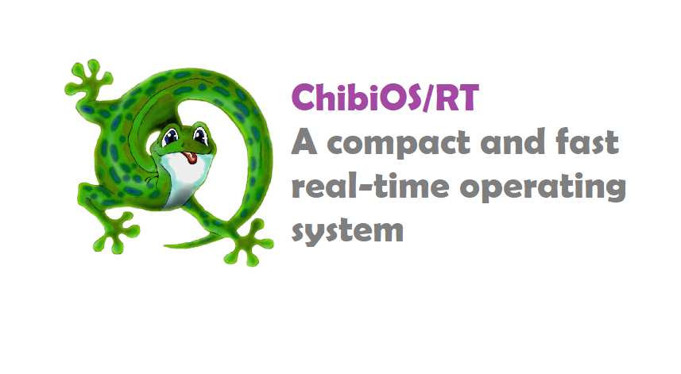

# ChibiOS
## Introduction


- Abstracting away timing information. This allows the structure of the  application code to be simplier and smaller.
- Maintainability/Extensibility. Fewer dependencies between modules.
- Task modularity.
- Event-driven means improved effiency.
- Easier power management when idle task is detected.
- Flexible interrupt handling

## How works?

### Requirements

1. Developer ARM Toolchain. 
    + Manual installation > developer.arm.com
    + Package manager > sudo apt-get install gcc-arm-none-eabi.
2. Download specific version of ChibiOS for RPi B
    - [Github repository of ChibiOS-RPi B](github.com/steve-bate/Chibios-Rpi)
3. Prepare Minimum bootable SD-Card for the Raspberry Pi B
    - bootcode.ini - [Download here](data/bootcode.bin)
    - start.elf - [Download here](data/start.elf)
    - It has been said that _loader.bin_ is not necessary, so we have deleted it.

In order to know if the Developer ARM Toolchain is correctly working:

```
arm-none-eabi-gcc --version
```

Expected output:

```
arm-none-eabi-gcc (15:9-2019-q4-0ubuntu2) 9.2.1 20191025 (release) [ARM/arm-9-branch revision 277599]
Copyright (C) 2019 Free Software Foundation, Inc.
This is free software; see the source for copying conditions.  There is NO
warranty; not even for MERCHANTABILITY or FITNESS FOR A PARTICULAR PURPOSE.
```

### Demos

The different demos can be downloaded from [here](https://cv.udl.cat/access/content/group/103056-2122/Programs_Firmwares/ChibiOS/demos_ChibiOS.zip). You will have to be in `ChibiOS-RPI/demos/<name_demo>`. The directory should have this structure
```
- build/
    - ch.bin
    - ...
- chconf.h
- halconf.h
- main.c
- Makefile
- mcuconf.h
- readme.txt
```
In order to build the binary you must open the terminal and type `make`.

Then, in `build/` directory, it must have been created a `ch.bin` file. Put the file on the **SD card**  and rename it into `kernel.img`.

### LCD Screen

For LCD Screen, there is an example of that:

```c

#include "ch.h"
#include "hal.h"
#include "chprintf.h"

static WORKING_AREA(waThread_LCD, 128);
static msg_t Thread_LCD(void *p) {
  (void)p;
  chRegSetThreadName("SerialPrint");
  uint16_t iteration=0;
  while (TRUE) {
    sdPut(&SD1, (uint8_t)0x7C);
    sdPut(&SD1, (uint8_t)0x18);
    sdPut(&SD1, (uint8_t)0x20);
    chThdSleepMilliseconds(10);
    
    sdPut(&SD1, (uint8_t)0x7C);
    sdPut(&SD1, (uint8_t)0x19);
    sdPut(&SD1, (uint8_t)0x10);
    chThdSleepMilliseconds(10);  
    
    chprintf((BaseSequentialStream *)&SD1, "Iter.: %u", iteration);
    iteration++;
    chThdSleepMilliseconds(2000);
  }
  return 0;
}


/*
 * Application entry point.
 */
int main(void) {
  halInit();
  chSysInit();

  
  // Initialize Serial Port
  sdStart(&SD1, NULL); 

  // First Message
  chprintf((BaseSequentialStream *)&SD1, "Data consumer 1:"); 
   
  // Coordinates
  sdPut(&SD1, (uint8_t)0x7C);
  sdPut(&SD1, (uint8_t)0x18);
  sdPut(&SD1, (uint8_t)0x00);
  chThdSleepMilliseconds(10);
   
  sdPut(&SD1, (uint8_t)0x7C);
  sdPut(&SD1, (uint8_t)0x19);
  sdPut(&SD1, (uint8_t)0x20);
  chThdSleepMilliseconds(10); 

  // Second message
  chprintf((BaseSequentialStream *)&SD1, "Data consumer 2");
  
  // Start thread
  chThdCreateStatic(waThread_LCD, sizeof(waThread_LCD), HIGHPRIO, Thread_LCD, NULL);

  /*
   * Events servicing loop.
   */
  chThdWait(chThdSelf());

  return 0;
}
```

The LCD Screen has some several issues about printing the floats, so it has been changed the `chprintf.h`, specifically, `ftoa` to not only change the precision of the float but also fix some bugs:

```c
#define FLOAT_PRECISION 100

static char *ftoa(char *p, double num) {
  long l;
  unsigned long precision = FLOAT_PRECISION;

  l = (long) num;
  p = long_to_string_with_divisor(p, l, 10, 0);
  *p++ = '.';
  l = (long)((num - l) * precision);
  return long_to_string_with_divisor(p, l, 10, precision / 10);
}
```

Also, some macros have been created in order to set the different consants such as the total number of data saved in every dataproducer (20), or graphic LCD constants:
```cpp
#define MAX_DATA_UNITS 20
#define START_DRAW_X 0x1D
#define MAX_X 0x79
#define MAX_Y_GRAPH 0x31
```

## Arduino I2C

```c

#include "ch.h"
#include "hal.h"
#include "chprintf.h"

static const uint8_t slave_address = 0x04;


static WORKING_AREA(waThread_I2C, 128);
static msg_t Thread_I2C(void *p) {
  (void)p;
  chRegSetThreadName("SerialPrintI2C");
  uint8_t request[]={0,0};
  uint8_t result=0;
  msg_t status;
  
  // Some time to allow slaves initialization
  chThdSleepMilliseconds(2000);
  
  while (TRUE) {

    // Request values
    i2cMasterTransmitTimeout(
                        &I2C0, slave_address, request, 2, 
                        &result, 1, MS2ST(1000));
    chThdSleepMilliseconds(10);
     
    sdPut(&SD1, (int8_t)0x7C);
    sdPut(&SD1, (int8_t)0x18);
    sdPut(&SD1, (int8_t)0x00);
    chThdSleepMilliseconds(10);
    
    sdPut(&SD1, (int8_t)0x7C);
    sdPut(&SD1, (int8_t)0x19);
    sdPut(&SD1, (int8_t)0x20);
    chThdSleepMilliseconds(10);
      
    chprintf((BaseSequentialStream *)&SD1, "Aval. %ux%u: %u  ", 
                                     request[0],request[1], result);
    request[1]++;
    if (request[1]>10) {
      request[1] = 0;
      request[0]++;
    }
      
    chThdSleepMilliseconds(2000);
  }
  return 0;
}

int main(void) {
  halInit();
  chSysInit();

  // Initialize Serial Port
  sdStart(&SD1, NULL); 
  
  /*
   * I2C initialization.
   */
  I2CConfig i2cConfig;
  i2cStart(&I2C0, &i2cConfig);
   
  chThdCreateStatic(waThread_I2C, sizeof(waThread_I2C), 
                                          HIGHPRIO, Thread_I2C, NULL);

  // Blocks until finish
  chThdWait(chThdSelf());

  return 0;
}
```