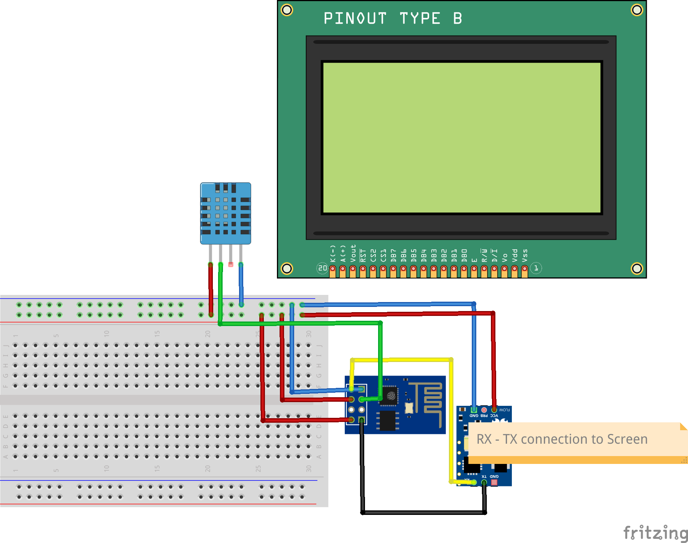

# Dataproducer 1

The Dataproducer 2 must receive the data of the temperature and humidity sensor and display it to the LCD Screen using the serial port. In addition, the data must be sent to the MQTT Broker.


## Components
- Temperature and humidity sensor
- LCD screen
- ESP-01
## Flux


## Wiring


## Bugs encountered
We put a cable in a pin on the breadboard that didn't work at all. We spend a couple of hours debugging it.


## Code

```cpp
#include "DHT.h"
#include <ESP8266WiFi.h>
#include <PubSubClient.h>

#define maxX 127//159 
#define maxY 63 //127

const char* ssid = "ssid";
const char* password = "password";
const char* mqtt_server = "192.168.4.1";

WiFiClient espClient;
PubSubClient client(espClient);
unsigned long lastMsg = 0;
#define MSG_BUFFER_SIZE  (50)
char msg[MSG_BUFFER_SIZE];
DHT dht(2, DHT11);

/* OUR FUNCTIONS */

void setup_wifi() {

  delay(10);

  WiFi.mode(WIFI_STA);
  WiFi.begin(ssid, password);

  while (WiFi.status() != WL_CONNECTED) {
    delay(500);
  }

  randomSeed(micros());

}

void reconnect() {
  // Loop until we're reconnected
  while (!client.connected()) {
    // Create a random client ID
    String clientId = "ESP8266Client-";
    clientId += String(random(0xffff), HEX);
    // Attempt to connect
    if (client.connect(clientId.c_str())) {
      client.publish("debug","connected");
      client.publish("outTopic", "hello world");
    } else {
      // Wait 5 seconds before retrying
      delay(5000);
    }
  }
}

void setX(byte posX) //0-127 or 0-159 pixels
{
  //Set the X position 
  Serial.write(0x7C);
  Serial.write(0x18);//CTRL x
  Serial.write(posX);
}

//-------------------------------------------------------------------------------------------
void clearScreen()
{
  //clears the screen, you will use this a lot!
  Serial.write(0x7C);
  Serial.write((byte)0); //CTRL @
  //can't send LCD.write(0) or LCD.write(0x00) because it's interprestted as a NULL
}
void setY(byte posY)//0-63 or 0-127 pixels
{
  //Set the y position 
  Serial.write(0x7C);
  Serial.write(0x19);//CTRL y
  Serial.write(posY);
  
}

void setHome() {
  setX((byte)0);
  setY((byte)0);
}


void setup() {
  setup_wifi();
  client.setServer(mqtt_server, 1883);
  dht.begin();
  Serial.begin(115200);
  delay(1200);
  clearScreen();
  setHome();//set the cursor back to 0,0.
  delay(10);
  Serial.print("Starting dataproducer1");
  delay(1000);
  Serial.print("Connecting to MQTT");
}

void tempAndHumidity(float tempC, float humidity, float heatIndex) {
  //This function shows how you could read the data from a temerature and humidity
  //sensor and then print that data to the Graphic LCD.

  clearScreen();
  //these could be varaibles instead of static numbers

  Serial.print("Temperature = ");
  Serial.print(tempC);
  Serial.print("C ");
  Serial.print("Humidity = ");
  Serial.print(humidity);
  Serial.print("%    ");
  Serial.print("Heat index = ");
  Serial.print(heatIndex);
  Serial.print("C ");

}


void loop() {
  // put your main code here, to run repeatedly:
  // Reading temperature or humidity takes about 250 milliseconds!
  // Sensor readings may also be up to 2 seconds 'old' (its a very slow sensor)
  if (!client.connected()) {
    reconnect();
  }
  client.loop();
  float h = dht.readHumidity();
  // Read temperature as Celsius (the default)
  float t = dht.readTemperature();
  if (isnan(h) || isnan(t)) {
    client.publish("debug","Failed to read from DHT sensor!");

  } else {
    float hic = dht.computeHeatIndex(t, h, false);
    tempAndHumidity(t, h, hic);
    unsigned long now = millis();
    if (now - lastMsg > 2000) {
      sprintf(msg, "{\"humidity\":%f,\"temperature\":%f,\"hic\":%f}", h, t, hic);
      client.publish("debug", "Published message");
      client.publish("debug","Publish message: ");
      client.publish("debug",msg);
      client.publish("windmill/dataproducer1", msg);
    }
  }
  client.publish("debug", "Finished Message Sending");
  
  // Compute heat index in Celsius (isFahreheit = false)
  delay(2500);

}

```