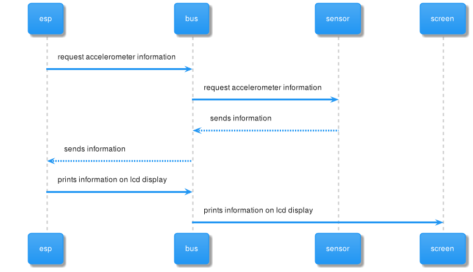

# Data producer 2

The Dataproducer 2 must receive the data from the accelerometer and display the data to a LCD Display via I2C protocol. In addition, the data must be sent to the MQTT Broker.

## Components
- ESP-01
- I2C bus
- Accelerometer
- LCD display

## Flux


## Wiring


## Examples that is based the code
- Broker publisher example
- LED I2C display example
- Accelerometer example

## Code

```cpp
#include <LiquidCrystal_I2C.h>

/* Dataproducer 2
 * 
 * 
 */

#include <Adafruit_Sensor.h>

#include <Adafruit_ADXL345_U.h>

#include <Wire.h>      // libreria de comunicacion por I2C
#include <ESP8266WiFi.h>
#include <PubSubClient.h>

const char* ssid = "ssid";
const char* password = "password";
const char* mqtt_server = "192.168.4.1";

WiFiClient espClient;
PubSubClient client(espClient);
unsigned long lastMsg = 0;
#define MSG_BUFFER_SIZE  (50)
char msg[MSG_BUFFER_SIZE];

Adafruit_ADXL345_Unified accel = Adafruit_ADXL345_Unified(12345);

LiquidCrystal_I2C lcd(0x27, 16, 2);  // DIR, E, RW, RS, D4, D5, D6, D7

void setup_wifi() {

  delay(10);

  WiFi.mode(WIFI_STA);
  WiFi.begin(ssid, password);

  while (WiFi.status() != WL_CONNECTED) {
    delay(500);
  }

  randomSeed(micros());

}

void reconnect() {
  // Loop until we're reconnected
  while (!client.connected()) {
    // Create a random client ID
    String clientId = "ESP8266Client-";
    clientId += String(random(0xffff), HEX);
    // Attempt to connect
    if (client.connect(clientId.c_str())) {
      client.publish("debug","connected");
      client.publish("outTopic", "hello world");
    } else {
      // Wait 5 seconds before retrying
      delay(5000);
    }
  }
}

void setup()
{
  Serial.begin(115200);
  setup_wifi();
  client.setServer(mqtt_server, 1883);
  client.publish("debug", "Setting LCD communication");
  lcd.setBacklight(HIGH);   // habilita iluminacion posterior de LCD
  lcd.begin(0, 2);     // 16 columnas por 2 lineas para LCD 1602A
  lcd.clear();      // limpia pantalla
  if (!accel.begin())
  {
    /* There was a problem detecting the ADXL345 ... check your connections */
    client.publish("debug", "Ooops, no ADXL345 detected ... Check your wiring!");
    while (1);
  }
  accel.setRange(ADXL345_RANGE_16_G);

}

void loop()
{
  if (!client.connected()) {
    reconnect();
  }
  client.loop();
  
  sensors_event_t event;
  accel.getEvent(&event);
  client.publish("debug", "Displaying information at LCD SCReen: ");
  lcd.setCursor(0, 0);    // ubica cursor en columna 0 y linea 0
  lcd.print("X:");
  lcd.print(event.acceleration.x);
  lcd.print(" Y:");
  lcd.print(event.acceleration.y);// escribe el texto
  lcd.setCursor(0, 1);
  lcd.print("Z: ");
  lcd.print(event.acceleration.z);// ubica cursor en columna 0 y linea 1
  unsigned long now = millis();
  if (now - lastMsg > 2000) {
    sprintf(msg, "{\"X\":%f,\"Y\":%f,\"Z\":%f}", event.acceleration.x, event.acceleration.y, event.acceleration.z);
    client.publish("debug", "Published message");
    client.publish("debug","Publish message: ");
    client.publish("debug",msg);
    client.publish("windmill/dataproducer2", msg);
  }
  client.publish("debug", "Finished Message Sending");
  delay(2500);
}
```