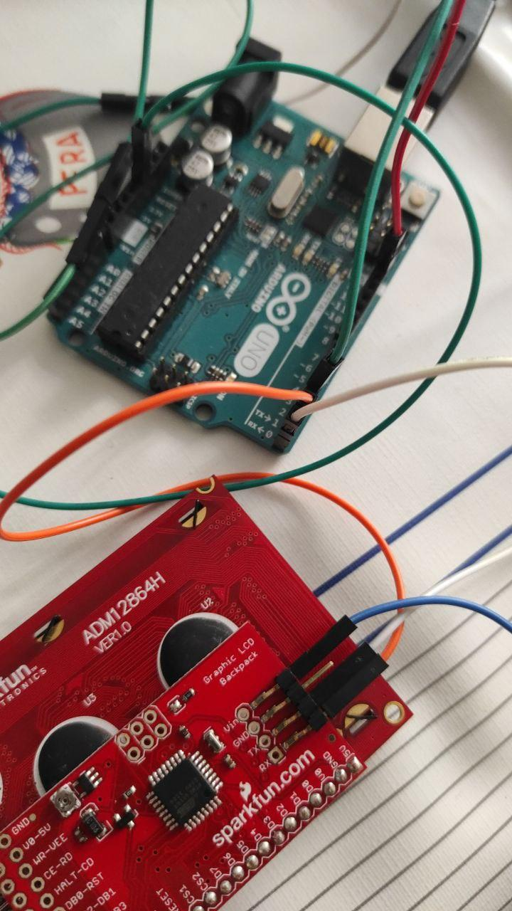

# LCD Screen

[DataSheets Technical Docs](https://cv.udl.cat/access/content/group/103056-2122/Datasheets%20_%20Technical%20docs./SerialGraphicLCD-v2.pdf)

## Code

Library: [SparkFun Graphic LCD Serial Backpack](https://github.com/sparkfun/GraphicLCD_Serial_Backpack)

Example code: [here](https://platformio.org/lib/show/863/SparkFun%20Graphic%20LCD%20Serial%20Backpack)

### How works
You give the information of the pointer to start writing and, then, give the string.

## Configuration of the board 

The Rx of the LCD must be the Tx of the board and the other way around. 

