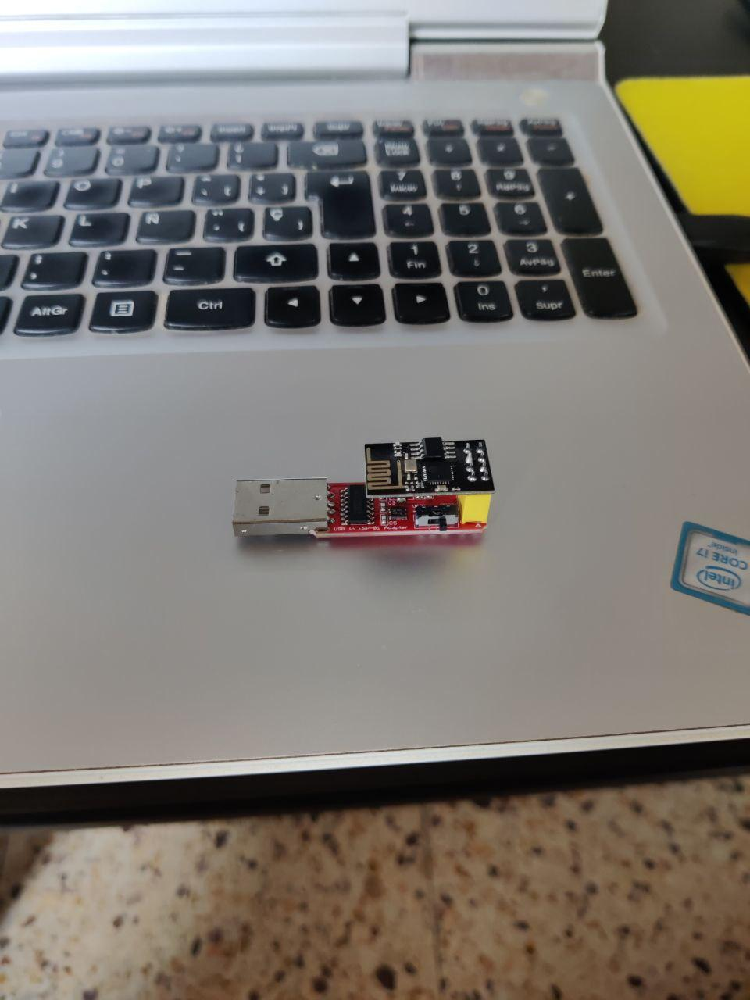

# Getting Started

This file how to program in ESP-01.

## Configure Arduino IDE
Click **Ctrl+,** to open the configuration.

Paste [https://arduino.esp8266.com/stable/package_esp8266com_index.json](https://arduino.esp8266.com/stable/package_esp8266com_index.json)
into Additional Boards Manager URLs.

Then, at **Tools > Boards > Boards manager** you can download the board.

**Don't forget to put the board as aa esp8266!**

## Connect USB device to ESP01

The correct orientation of ESP is:

The switch button defines the state of the connection.

- Developer mode to compile and put the code into the ESP01.
- Supplier mode. The usb provides the energy to the ESP01.

