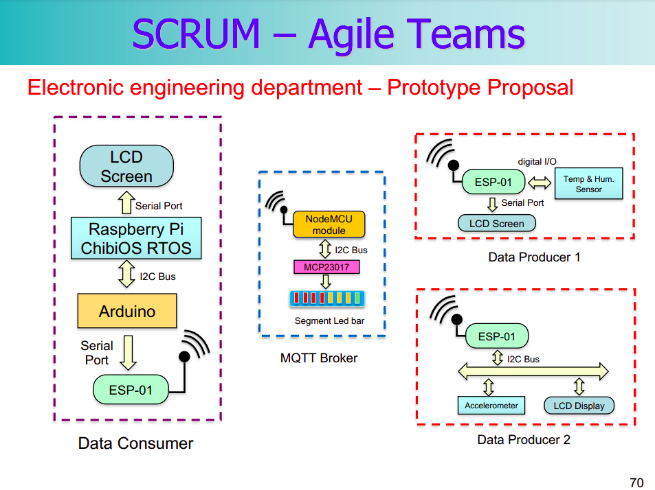

# Wind Farm Project

## Project layout

    mkdocs.yml    # The configuration file.
    docs/
        index.md  # The documentation homepage.
        ...       # Other markdown pages, images and other files.

## Publish this to Github Pages
* `mkdocs gh-deploy` will publish whatever the branch you are currently working on. It will probably be cool to have a GitHub action.

## Github Repository

The link to the Github Repository can be found [here](https://github.com/Oriolac/seu/).

## Github Project

The link to the Github SCRUM Project can be found [here](https://github.com/users/Oriolac/projects/1).
