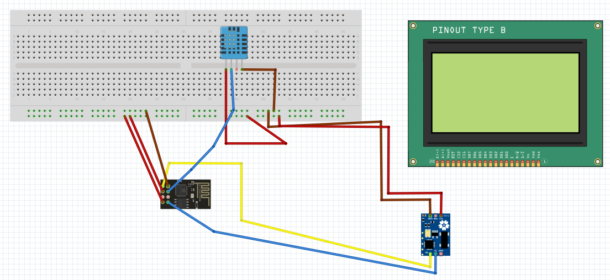
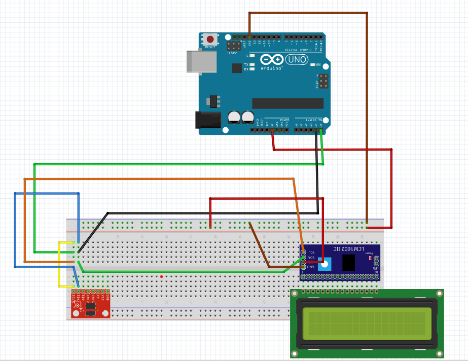

# Sprint 1

The first sprint was held from 29th October to 12th November.

## User Stories

The user stories related to this sprint are the following ones:

- **US1**. It    is    necessary    to    obtain    the    temperature    and    humidity    at    the    top    of     the    WTG.
- **US2**. It    is    necessary    to    determine    the    WTG    tower    movement.

## Tasks and Assigments

The tasks and assignments for this sprint, which are related to the user stories previously mentioned, are the following:

- Setting environment of work. *Oriol, Quim & Sergi*
    - Installing Arduino IDE
    - Installing libraries
- Analysis. *Oriol, Quim & Sergi*
- Board with Fritzing. *Oriol*
    - Dataproducer 1. 
    - Dataproducer 2.
- Test connection of components with arduino
    - DHT11. *Sergi, Oriol*
    - LCD Screen. *Sergi*
    - LCD Display. *Sergi, Quim*
- Code and development
    - Dataproducer 1. *Sergi, Quim*
    - Dataproducer 2. *Sergi, Oriol*

The total amount of points for this sprint was **28**. The management of the tasks and issues mentioned is held [here](https://github.com/users/Oriolac/projects/1/).

## Progression

### DTO 1

Regarding the dataproducer one, it was made the first approach of getting the temperature, humidity and heat index using Arduino Uno. When it was finally working, it was changed to ESP01.

### DTO 2

Regarding the dataproducer two, it was made the first approach of getting the temperature, humidity and heat index using Arduino Uno. When it was finally working, it was changed to ESP01.

## Troubles found

- Understanding arduino environment for the first time
- Sparkfun Graphic LCD Serial Backpack library did not work correctly
    - Solution: Doing it with Serial manually
- Understanding I2C bus
- It was missed more management of the issues (having more realistic backlog of the project) and putting the weights to the issues.

## Miscelaneous

The slides for the Sprint 1 can be found [here](https://docs.google.com/presentation/d/15G14suaCFX4XvX2A6YMgebiaef3y8DuZf9PoxsEkkZk/edit?usp=sharing)
