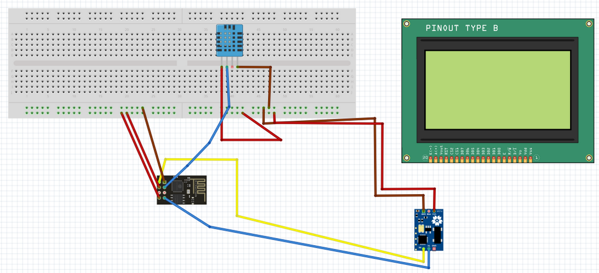
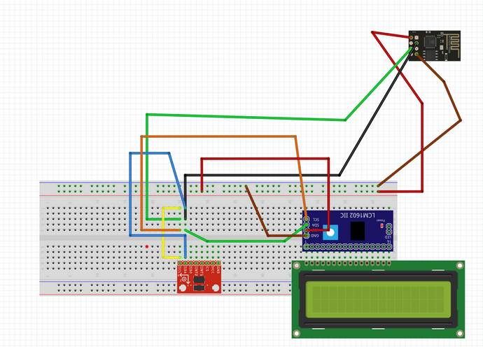
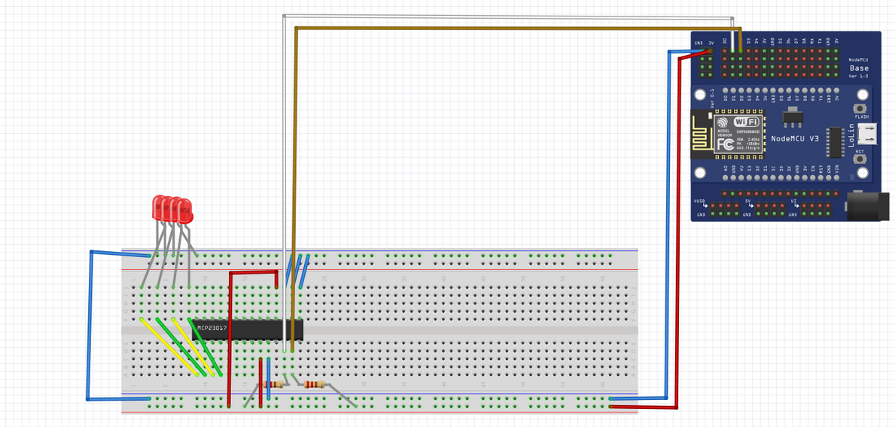

# Sprint 2

The second sprint was held from 13th October to 26th November.

## User Stories

The user stories related to this sprint are the following ones:

- **US3**. Sensor data must be sent to the MQTT broker using ESP-01. *It has been spent 24h*.
- **US4**. MQTT broker must show the current number of connections (percentage). *It has been spent 18h*.
- **US5**. Maintenance manager requires graphically representation of the obtained sensor data, within the last 24h, in the Supervision Station. *It has been spent 14h*.

Globally, it has been spent 54h.

## Tasks and Assigments

The tasks and assignments for this sprint, which are related to the user stories previously mentioned, are the following:

The total amount of points for this sprint was **47**. The management of the tasks and issues mentioned is held [here](https://github.com/users/Oriolac/projects/1/).

## Progression

### DTO 1

The workpath of the DTO1 for this sprint is the following:

1. Redessign board connections to use ESP-01
2. Search for libraries and examples to see how to publish messages 
3. Develop publisher logic
4. Test connection with a mosquitto server
5. Test connection with NodeMCU

### DTO 2

The workpath of the DTO2 for this sprint is the following:

1. Redessign board connections to use ESP-01
2. Develop publisher logic
3. Test connection with a mosquitto server & Debug
4. Test connection with NodeMCU

### MQTT Broker

The workpath of the MQTTBroker for this sprint is the following:

1. Analysis & documentation
2. Subscriber and publisher mocks with mosquitto
3. Debug channel for testing
4. Subscriber channel for testing
5. MCP Led bar

For turning the number into a binary channel representation, it has been created our own representation function using: `2^(n) - 1`

The video can be found in the [presentation slides](#miscelaneous).

### RPi w/ ChibiOS

The workpath of the Supervision Station for this sprint is the following:

1. Analysis & search for documentation of ChibiOS and RPi
2. Led blink test
3. LCD Screen test
4. I2C test

It has been tested the ChibiOS and it has been found that the SDCard given to us had an error. Also, it has been done the documentation for making easy to start developing the Supervision Station in the next sprint. The video can be found in the [presentation slides](#miscelaneous).

## Miscelaneous

The slides for the Sprint 2 can be found [here](https://docs.google.com/presentation/d/1AQJoerh7DT9Wxh1N1sOndmkQTvIrPiEeq6F_IczKm0E/edit?usp=sharing)
