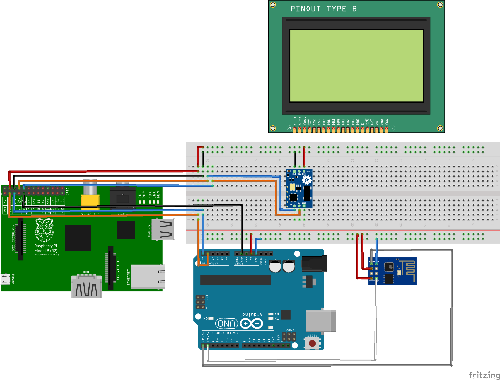
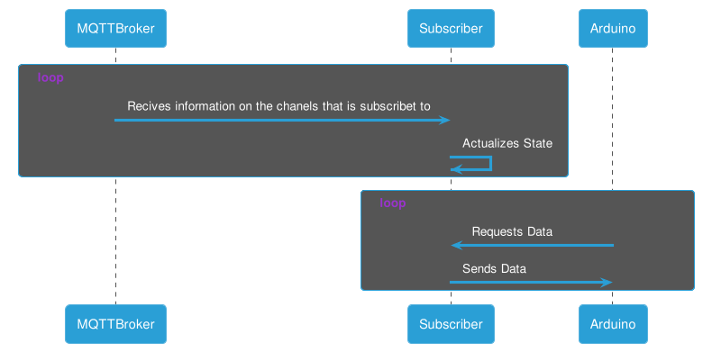
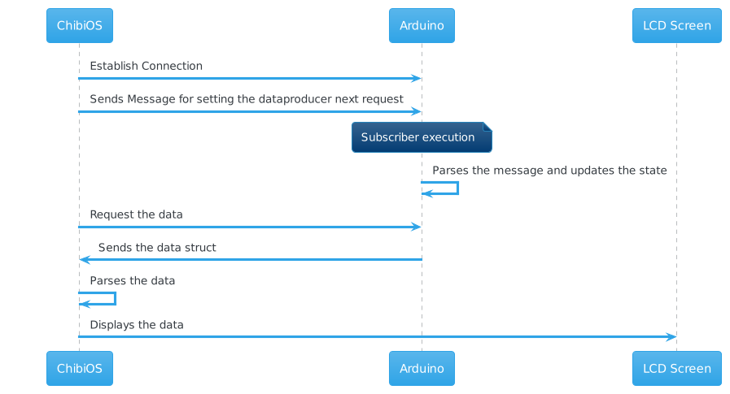

# Sprint 3

The third sprint was held from 27th October to 10th December.

## User Stories

The user stories related to this sprint are the following ones:

- **US3**. Sensor data must be must be sent to a Supervision Station.
- **US5**. Maintenance manager requires graphically representation of the obtained sensor data, within the last 24h, in the Supervision Station.

### Functional requirements:

- A WiFi module for connecting to the MQTT broker and subscribe to the data. *It has been spent 15h*
- A middleware module for connecting the WiFi module to RT module. *It has been spent 15h*
- A RT module for catching the data from the middleware and displaying it by a LCD Screen. *It has been spent 8h*

Globally, it has been spent 38h.

## Tasks and Assigments

The tasks and assignments for this sprint, which are related to the user stories previously mentioned, are the following:

The total amount of points for this sprint was **28**. The management of the tasks and issues mentioned is held [here](https://github.com/users/Oriolac/projects/1/).

## Progression of Supervision Station

The work of the Supervision has been splitted into 3 parts:

1. ESP-01 Subscriber
2. RPi + Arduino
3. RPi + LCD Screen

The video demonstration of the project can be found in the [presentation slides](#miscelaneous).

### ESP-01 Subscriber

The workpath of the ESP-01 subscriber for this sprint is the following:

1. Try to flash ESP8266 firmware with AT Commands to ESP-01
2. Implement our own protocol
3. Develop subscriber logic.
4. Test Subscriber Logic
5. Develop arduino communication using serials.
6. Test connection with arduino.

In order to communicate with the Arduino, it has been created a protocol:

1. ESP-01 actualizes the data every time a message is sent to the broker.
2. Communication starts on Arduino:
      - Arduino Sending: “0” - ESP-01 Returns: “test”
      - Arduino Sending: “1” - ESP-01 Returns: { “temperature”: 23.00 , “humidity”:43.00,  “hic”:25.00 }
      - Arduino Sending: “2” - ESP-01 Returns: { “X” : 0.12, “Y” : 3.56, “Z” : 13.32};”
      - Arduino Sending: “j” - ESP-01 Returns: Full json for debugging purposes.
3. Arduino parses json using ArduinoJson and sends info to Reporting center

### RPi + Arduino

The communication between RPi and Arduino is done by I2C.

The workpath was the following:

1. Attempting to send and receive a character.
2. Attempting to send and receive multiple characters (string).
3. Attempting to send and receive a struct.
4. Turning the data received from ESP01 to the desired struct.

#### Troubleshoot

In order to control the I2C bus, ChibiOS resets the configuration when a *Q_RESET* or *Q_TIMEOUT* flag is received.
In addition, the arduino must have the slave address of 0x04, otherwise, it will not work.

### RPi + ChibiOS

The workpath for this sprint is the following:

1. Print characters to the screen
2. Draw lines to the screen
3. Play with the position of the lines
4. Code structure for plots.
5. Draw a plot.
6. Turn the data from the structs received from the arduino to the structs needed for drawing.

In order to implement the lines functions, it has been reviewed the Sparkfun BackPack LCD Screen. The development is built with structures for displaying the information.

#### Troubleshoot

There was a problem with displaying the float properly.

1. It has been modified the chprintf.c in order to display correctly the floats.
2. It has been modified the float precision to 2 decimals.

## Miscelaneous

The slides for the Sprint 3 can be found [here](https://docs.google.com/presentation/d/1_hAJdyse-bvGyyvQKseHs7tA3uVKPcMMpttPS8yRY5Y/edit?usp=sharing)
